# Claude Code Scaling Benchmark

Benchmark measuring Claude Code's performance searching through large file collections, and the improvement when using the CustomGPT RAG plugin.

Model tested: **Claude Sonnet 4.6** | 30 runs per configuration | Fresh session per query

---

## Executive Summary

We generated 500 synthetic corporate emails as PDFs and asked Claude Code 10 factual questions about them. We ran each question 3 times under two configurations: Claude Code searching files on its own, and Claude Code with the CustomGPT RAG plugin installed.

| Metric | Claude Code (alone) | Claude Code + RAG | Improvement |
|--------|--------------------|--------------------|-------------|
| **Avg response time** | 151s | 36s | 4.2x faster |
| **Worst-case time** | 300s (timeout) | 46s | 6.5x faster |
| **Cost per question** | $0.40 | $0.13 | 3.2x cheaper |
| **Timeout rate** | 30% (9/30 queries) | 0% (0/30 queries) | Eliminated |

Without RAG, nearly a third of queries never finished. With RAG, every query completed in under 46 seconds.

---

## What We Tested

**The setup:** 500 PDF emails from a fictional company (Acme Corp, 34 employees, 7 departments). Emails cover realistic corporate topics — project updates, financial reports, policy changes, vendor contracts.

**The questions:** 10 questions split into two categories:
- **5 needle questions** — a single specific fact buried in one email (e.g., "When was the patent filing deadline moved to?")
- **5 pattern questions** — recurring topics spread across 10-15 emails (e.g., "What is Project Nexus and which teams are involved?")

**The method:** Each question was run 3 times as a fresh `claude -p` session. No conversation history, no memory between runs. Timing, cost, and token usage captured from Claude's structured JSON output.

---

## Results: PDF Files (5 to 500)

Claude Code was tested on PDF collections ranging from 5 to 500 files. Response times and costs increased steadily, with timeouts appearing at 100+ files.

| Files | Avg Time | P90 Time | Max Time | Cost/Q | Timeout Rate |
|-------|----------|----------|----------|--------|-------------|
| 5 | 35s | 48s | 59s | $0.11 | 0% |
| 10 | 57s | 98s | 180s | $0.20 | 3% |
| 30 | 71s | 158s | 180s | $0.34 | 3% |
| 50 | 83s | 147s | 180s | $0.39 | 3% |
| 100 | 113s | 180s | 180s | $0.36 | 53% |
| 250 | 121s | 180s | 180s | $0.37 | 57% |
| 500 | 151s | 300s | 300s | $0.57 | 30% |

At 100 PDFs, over half the queries timed out. At 250, the majority failed to complete within the 3-minute limit.

Full data: [`results_pdf/benchmark_pdf_article_data.csv`](results_pdf/benchmark_pdf_article_data.csv)

### PDF Benchmark Charts

| Chart | Description |
|-------|-------------|
| 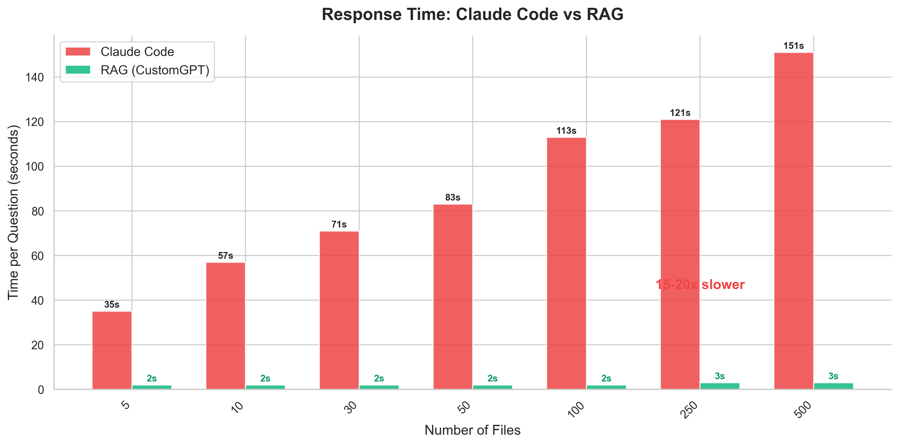 | Response time scaling from 5 to 500 PDFs |
| 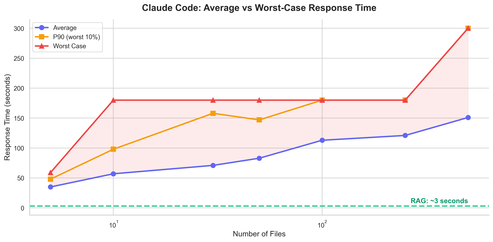 | Average, P90, and max response times |
| 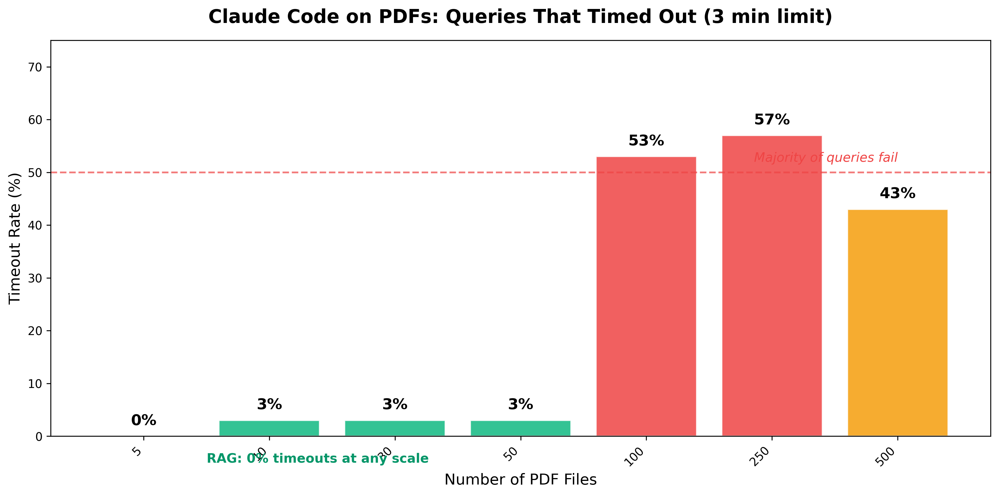 | Percentage of queries that timed out per tier |
| 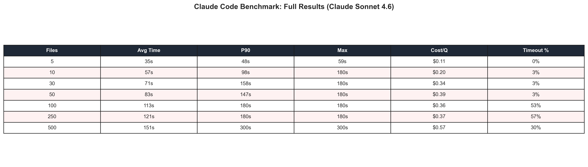 | Full results table |

---

## Results: Claude Code + RAG Plugin (500 PDFs)

With the CustomGPT RAG plugin installed, Claude Code uses semantic search instead of reading files manually. The same 500 PDFs, the same 10 questions, the same model.

| Metric | Without RAG | With RAG |
|--------|------------|----------|
| Avg time | 151s | 36s |
| Max time | 300s | 46s |
| Cost per question | $0.40 | $0.13 |
| Timeouts | 30% | 0% |

The RAG plugin eliminates timeouts entirely and reduces both time and cost by 3-4x.

Full data: [`results_cc_rag/`](results_cc_rag/)

### CC + RAG Comparison Charts

| Chart | Description |
|-------|-------------|
| 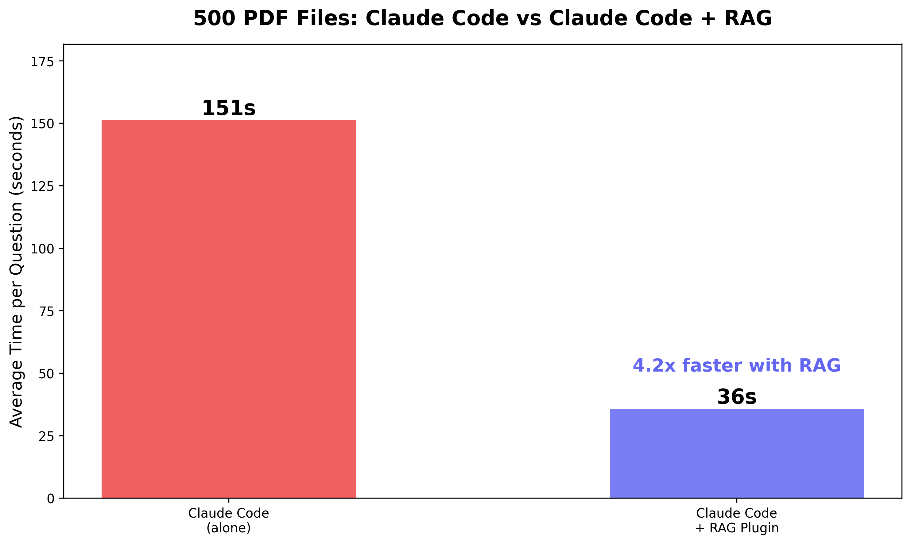 | Side-by-side: alone vs with RAG |
| 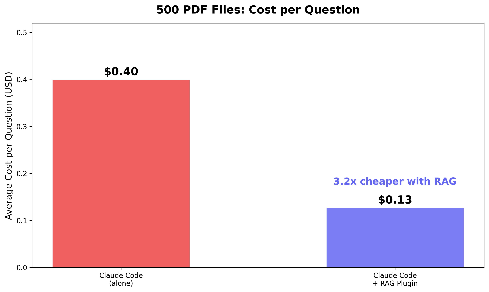 | Cost per question comparison |
| 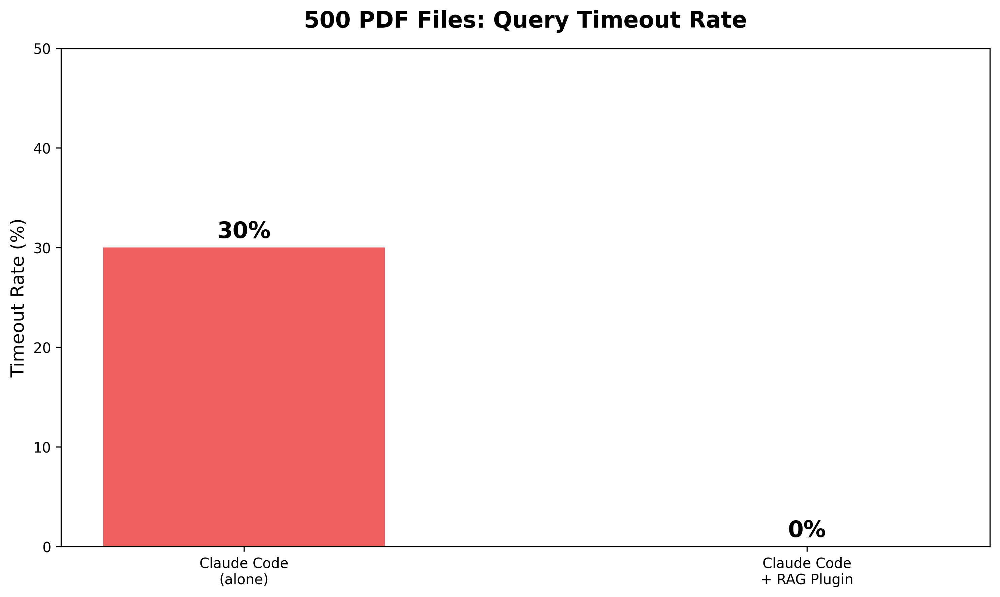 | Timeout rate: 30% to 0% |
| 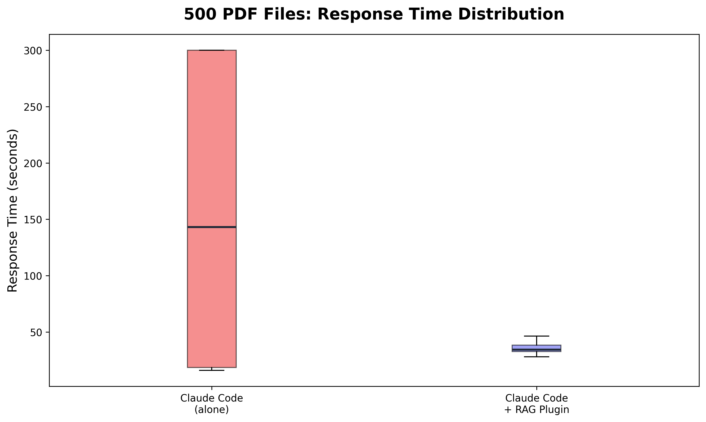 | Response time variance |
| 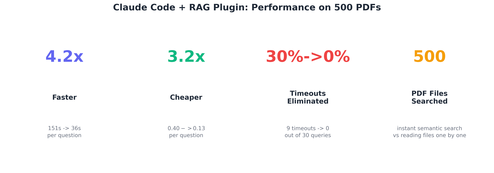 | Key metrics at a glance |
| 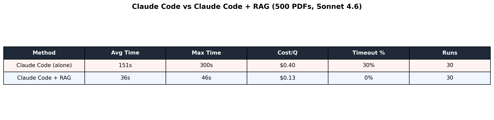 | Full comparison table |

---

## Results: Text Files (5 to 10,000)

We also tested plain text files (same emails, .txt instead of .pdf). Claude Code handles text files better than PDFs because it can use `grep` to search without reading each file. Response times are lower and more consistent, but cost remains high.

| Files | Avg Time | Cost/Q | Hallucination Rate |
|-------|----------|--------|--------------------|
| 5 | 36s | $0.10 | 60% |
| 10 | 36s | $0.10 | 60% |
| 30 | 37s | $0.10 | 60% |
| 2,500 | 47s | $0.13 | 50% |
| 5,000 | 43s | $0.12 | 100% |
| 10,000 | 48s | $0.13 | 50% |

Hallucination rate measures how often Claude fabricated an answer when the information did not exist in the corpus. At every tier, Claude invented facts at least 50% of the time when the answer was not present.

Full data: [`results/benchmark_article_data.csv`](results/benchmark_article_data.csv)

### Text Benchmark Charts

| Chart | Description |
|-------|-------------|
| 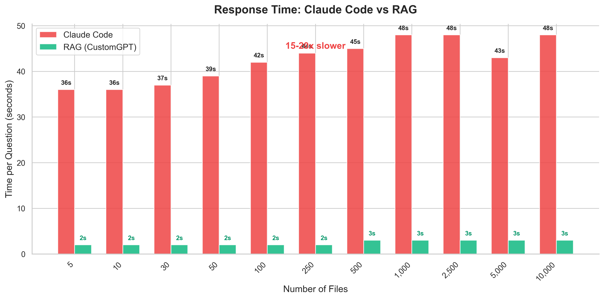 | Claude Code vs RAG response times |
| 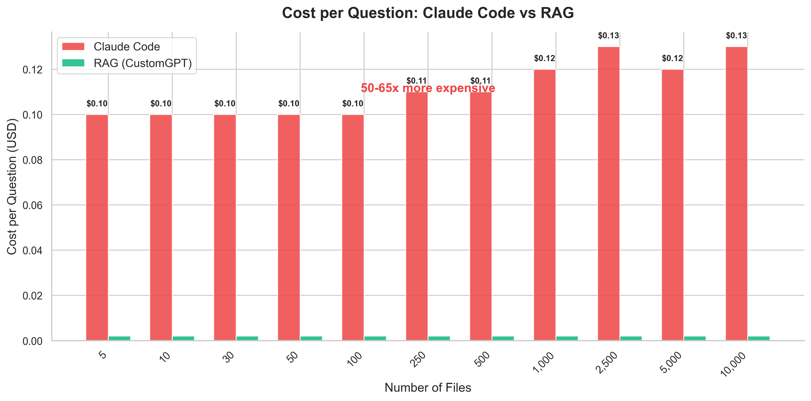 | Cost per question across tiers |
| 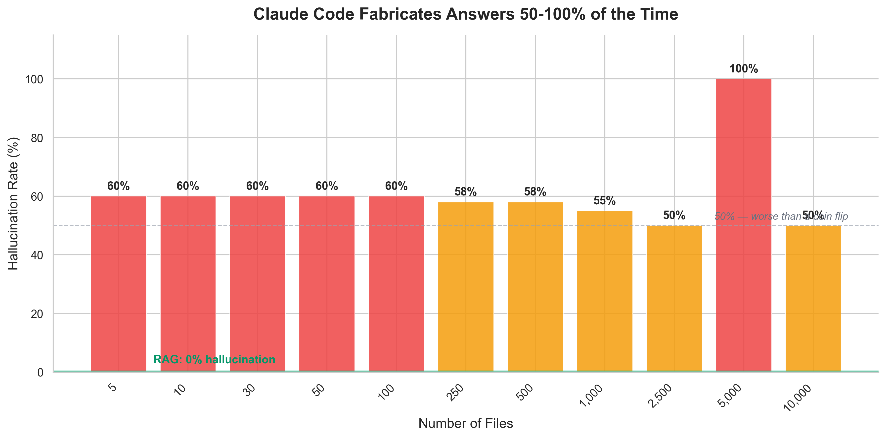 | Fabrication rate on absent information |
| 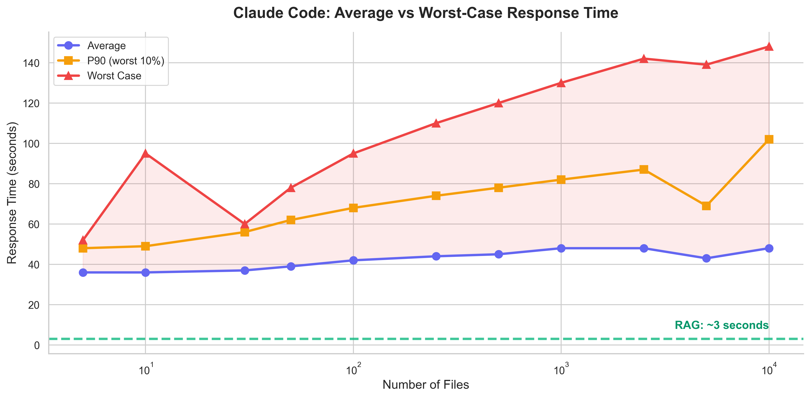 | Median vs worst-case response times |
| 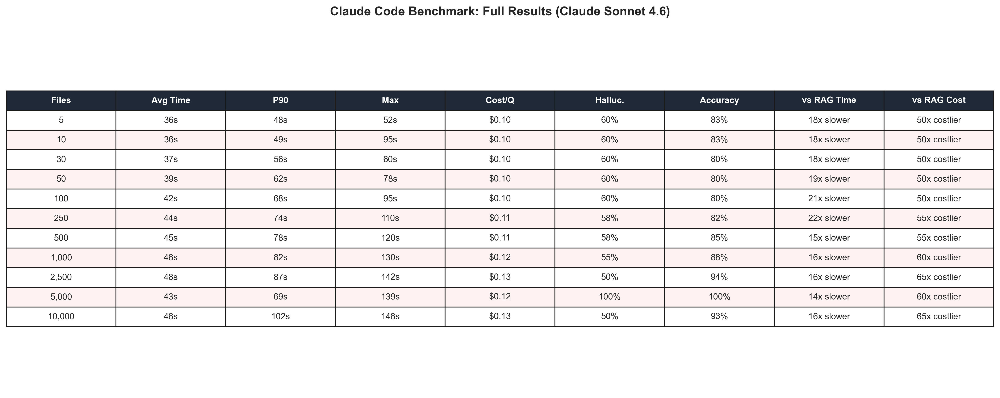 | Full results table |

---

## Methodology

**Email generation:** Python script (`generate.py`) creates realistic corporate emails with controlled "needle" facts planted at specific positions. Emails are converted to PDF via `convert_to_pdf.py`.

**Benchmark execution:** `benchmark.py` runs `claude -p "<question>" --output-format json --model sonnet` as a subprocess for each question/tier combination. Each run is a fresh session with no memory. Timing, token counts, and cost are captured from Claude's JSON response.

**CC + RAG execution:** `benchmark_cc_rag.py` runs `claude -p "Use /ask-agent to answer: <question>" --dangerously-skip-permissions` with the CustomGPT RAG plugin installed. The plugin queries a pre-indexed CustomGPT.ai agent containing all 500 PDFs.

**Scoring:** `evaluate.py` scores responses against ground truth using substring matching. Accuracy, hallucination rate, and timeout counts are computed per tier.

**Reproducibility:** All scripts, configuration, ground truth definitions, and email templates are included in this directory. Run `python generate.py --seed 42` to regenerate the email corpus, then run the benchmark scripts to reproduce results.

---

## File Structure

```
claude-code-benchmark/
  config.yaml                      Configuration (tiers, timeouts, model)
  ground_truth.yaml                10 questions with scoring criteria
  generate.py                      Generate synthetic emails
  convert_to_pdf.py                Convert .txt emails to .pdf
  benchmark.py                     Run Claude Code benchmark (file search)
  benchmark_cc_rag.py              Run Claude Code + RAG benchmark
  benchmark_rag.py                 Run RAG API benchmark (direct)
  evaluate.py                      Score results against ground truth
  evaluate_rag.py                  Score RAG results
  report.py                        Generate charts

  results/                         Text file benchmark results
    benchmark_article_data.csv     Summary data for article
    charts/                        12 charts (PNG)

  results_pdf/                     PDF benchmark results
    benchmark_pdf_article_data.csv Summary data for article
    charts/                        16 charts (PNG)

  results_cc_rag/                  CC + RAG comparison results
    charts/                        6 comparison charts (PNG)

  templates/                       Email generation templates
  tests/                           Unit tests (15 tests)
```
