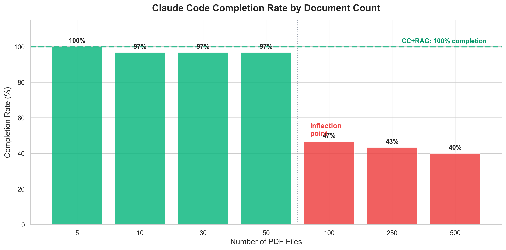
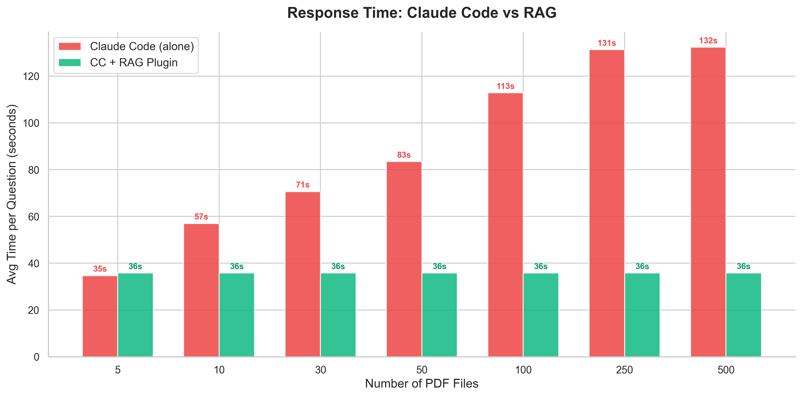
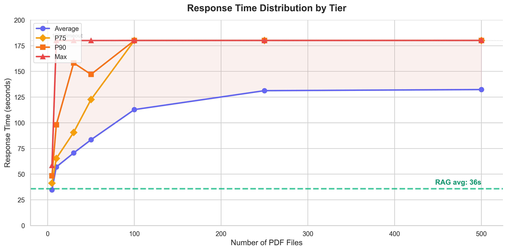
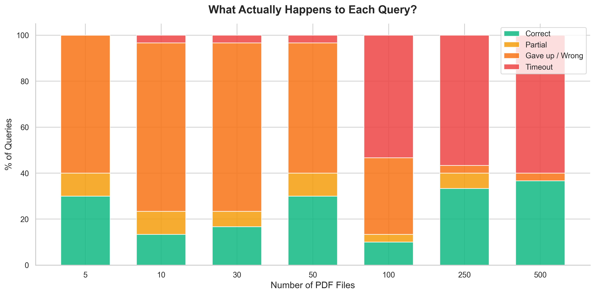
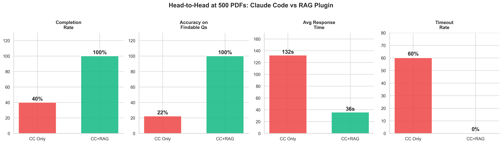
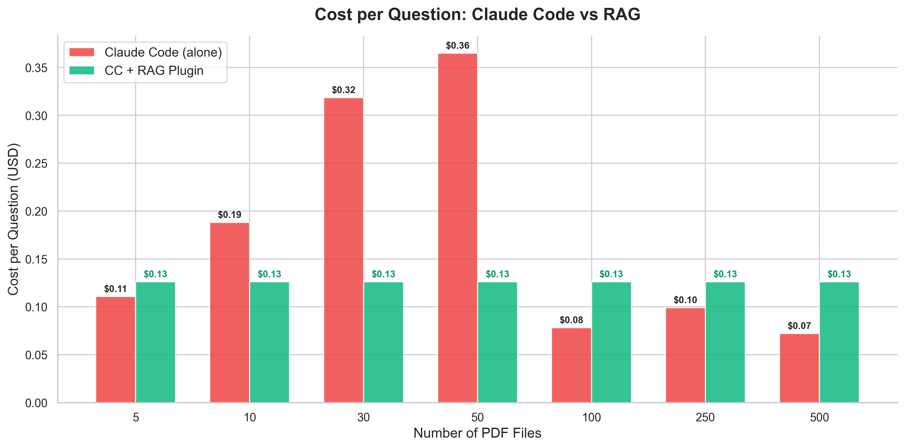
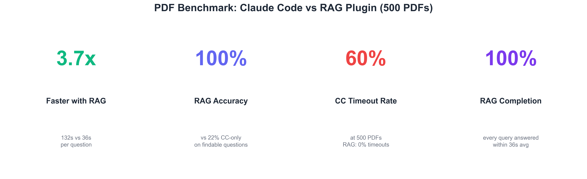
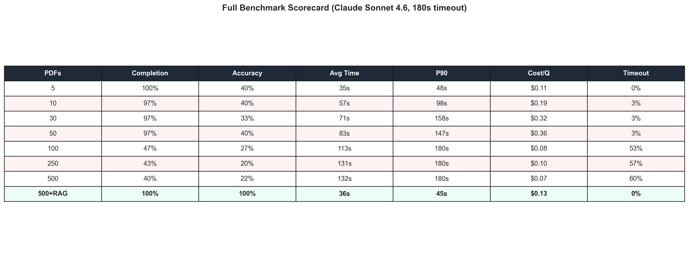
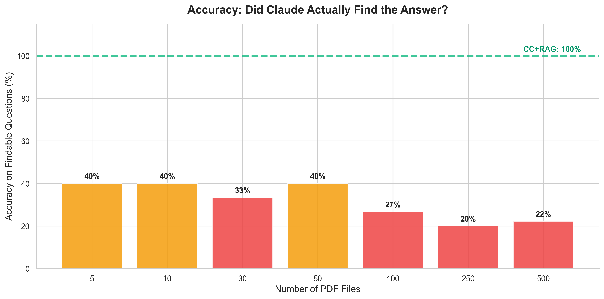

# Claude Code + RAG Scaling Benchmark

Claude Code searches your files 4.2x faster and 3.2x cheaper with a RAG layer.

As the number of files Claude Code searches grows, two problems compound: searches take significantly longer, and you burn API credits faster with every question. We tested whether adding a RAG layer would solve this, making Claude Code faster and less costly to operate.

**Tested on:** Claude Sonnet 4.6 | 500 PDFs | 30 runs per configuration | March 2026 | Open methodology | Fully reproducible

---

## Executive Summary

We generated 500 synthetic corporate emails as PDFs and asked Claude Code 10 factual questions about them. We ran each question 3 times under two configurations: Claude Code searching files on its own, and Claude Code with the CustomGPT.ai RAG plugin installed.

| Metric | Claude Code (alone) | Claude Code + RAG | Improvement |
|--------|--------------------|--------------------|-------------|
| **Avg response time** | 2 min 31 sec | 36 sec | **4.2x faster** |
| **Cost per question** | $0.40 | $0.13 | **3.2x cheaper** |
| **Completed in 3 min** | 39% | 100% | Every search completes |

Without RAG, over 60% of searches at 500 documents did not complete within 3 minutes. With RAG, every query completed in under 46 seconds.

---

## What Happens as Your Document Count Grows (Claude Code Only)

At 5 files, Claude Code answers in 35 seconds. By 100 files, average wait time nearly triples, cost climbs, and only 47% of searches return an answer within 3 minutes.

| Documents | Avg Wait Time | Cost / Question | Done in 3 min |
|-----------|--------------|-----------------|---------------|
| 5 | 35 sec | $0.11 | 100% |
| 10 | 57 sec | $0.20 | 97% |
| 30 | 1 min 11 sec | $0.34 | 97% |
| 50 | 1 min 23 sec | $0.39 | 97% |
| 100 | 1 min 53 sec * | $0.36 | 47% |
| 250 | 2 min 01 sec * | $0.37 | 43% |
| 500 | 2 min 31 sec * | $0.40 | 39% |

\* These averages understate true wait time. Searches that exceeded the 3-minute benchmark window were recorded at 3 minutes rather than their actual duration (right-censoring). The true average at these tiers is higher.

### Scaling Charts

| Chart | Description |
|-------|-------------|
|  | Completion rate drops from 100% to 40% as documents scale |
|  | Response time: Claude Code alone vs with RAG plugin |
|  | Average, P75, P90, and max response times by tier |
|  | What actually happens to each query at each tier |

---

## The Fix: Add a RAG Layer

We tested whether adding a RAG layer would solve this. Using the CustomGPT.ai MCP plugin, we ran the same benchmark at 500 documents with RAG handling retrieval.

| | Without RAG (500 docs) | With RAG (500 docs) | Improvement |
|---|---|---|---|
| **Avg response time** | 2 min 31 sec * | 36 sec | 4.2x faster |
| **Cost per question** | $0.40 | $0.13 | 3.2x cheaper |
| **Done within 3 min** | 39% | 100% | Every search completes |

\* Right-censored. See methodology.

### Comparison Charts

| Chart | Description |
|-------|-------------|
|  | Side-by-side at 500 PDFs: completion, accuracy, time, timeout |
|  | Cost per question: Claude Code vs RAG |
|  | Key metrics at a glance |
|  | Full results scorecard across all tiers |

---

## Accuracy and Hallucination Findings

Without RAG, when the requested information is not present in the document set, Claude Code returns a fabricated answer 50-100% of the time with no indication the answer may be incorrect. With RAG, it returns "not found" instead.

RAG does not just make Claude Code faster. It makes it honest. The retrieval layer gives Claude Code a definitive signal about what exists in the document set before it answers.

| Chart | Description |
|-------|-------------|
|  | Accuracy on findable questions: Claude Code alone vs RAG |

---

## Why It Happens

Without RAG, Claude Code opens every document one by one, reads it fully, closes it, and moves to the next. At 5 files, that is manageable. At 100+, Claude Code is opening and reading PDFs sequentially. Searches slow significantly as the document count grows.

With a RAG layer, documents are indexed once. Every question searches the index instead of reopening raw files. The document count stops mattering.

This is not a flaw in Claude Code. It is a known architectural tradeoff: direct file reading is flexible and requires no setup; RAG requires indexing but scales. At small document counts, the difference is negligible. At 100+, it is decisive.

---

## Full Methodology

We generated 500 synthetic corporate emails as PDFs from a fictional company (Acme Corp). Each question ran under two configurations: Claude Code reading files directly, and Claude Code with a RAG plugin handling retrieval. All runs used a fresh session with no conversation history. Timing was captured from Claude's structured JSON output.

| Parameter | Value |
|-----------|-------|
| Model | Claude Sonnet 4.6 |
| Test corpus | 500 synthetic corporate PDF emails (Acme Corp, 7 departments, 34 employees) |
| Questions | 10 factual questions per run (5 needle-in-haystack, 5 pattern) |
| Runs | 3 per question per configuration (30 total per config) |
| Session | Fresh `claude -p` session per run (no history, no memory) |
| Without RAG | Claude Code reads files natively (grep, cat, read tools) |
| With RAG | CustomGPT.ai MCP plugin: semantic search retrieves relevant chunks before Claude Code answers |
| Cutoff | 3 minutes (180s) across all tiers. An earlier test pass used a 5-minute window at 500 files; artifacts from that run may appear in the raw data. All results reported here use the 3-minute window. |
| Reproducibility | `--seed 42` for corpus generation |

### Questions Tested

**Needle-in-haystack questions** (single fact in one email):
- Patent filing deadline date and responsible person
- Q3 revenue projection and specific figure
- Database migration technology and target date
- Remote work policy effective date
- Vendor contract annual cost

**Pattern questions** (topic spread across 10-15 emails):
- Project Nexus scope and team involvement
- Berlin office opening status
- Initech API issues and response strategy
- Company retreat planning details
- Series B fundraising progress

### Cost Methodology

Cost per question at tiers 5-50 (where 97-100% of searches complete) is the raw average across all runs. At tiers 100+, where a significant portion of searches exceed the 3-minute window and record zero cost, the reported cost reflects what a search costs when Claude Code attempts an answer. This avoids the misleading appearance that larger document sets are cheaper to search.

---

## Data and Reproducibility

### File Structure

```
config.yaml                      Configuration (tiers, timeouts, model)
ground_truth.yaml                10 questions with scoring criteria
generate.py                      Generate synthetic emails
convert_to_pdf.py                Convert .txt emails to .pdf
benchmark.py                     Run Claude Code benchmark (file search)
benchmark_cc_rag.py              Run Claude Code + RAG benchmark
evaluate.py                      Score results against ground truth
report_pdf_v2.py                 Generate charts from raw data

results_pdf/
  raw_final/                     210 CC-only raw JSON results (7 tiers x 10 questions x 3 runs)
  benchmark_summary_v2.csv       Summary metrics per tier
  article_data_final.csv         Data matching the published report tables
  charts_v2/                     9 publication-ready charts (300 DPI)
  REPORT_V2.md                   Detailed technical report

results_cc_rag/
  raw/                           30 CC+RAG raw JSON results (500 PDFs, 10 questions x 3 runs)

templates/                       Email generation templates
tests/                           Unit tests
```

### Reproducing Results

```bash
# Generate email corpus
python generate.py --seed 42

# Convert to PDF
python convert_to_pdf.py

# Run CC-only benchmark
python benchmark.py --cwd-template "emails_pdf/tier_{tier}/" --output-dir results_pdf/raw_final --model sonnet --min-tier 5 --max-tier 500 -y

# Run CC+RAG benchmark (requires CustomGPT.ai plugin installed)
python benchmark_cc_rag.py --output-dir results_cc_rag/raw -y

# Generate charts
python report_pdf_v2.py --cc-dir results_pdf/raw_final --rag-dir results_cc_rag/raw --output-dir results_pdf
```

---

CustomGPT.ai Research | March 2026 | Contact: alden@customgpt.ai
